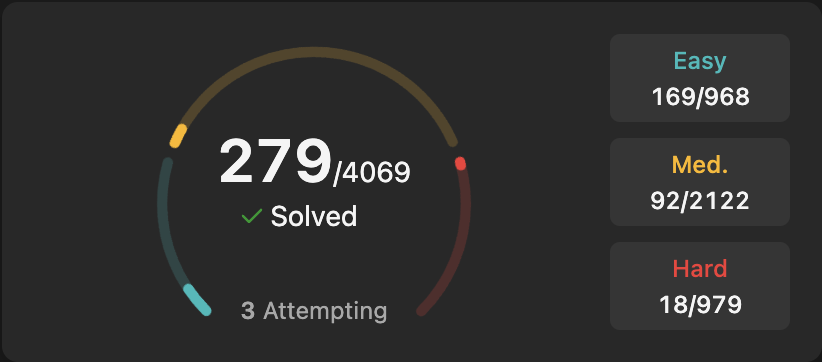

<h1 align="center">Hi, I'm Keshav Jha</h1>
<h3 align="center">Backend Developer @ MishiPay · Open-source contributor · Builder who likes to explore</h3>

  <a href="mailto:keshavkjha1999@gmail.com">Email</a> ·
  <a href="https://linkedin.com/in/ks48">LinkedIn</a> ·
  <a href="https://keshav.projectyourown.com/">Portfolio</a> ·
  <a href="https://www.leetcode.com/survivor_48">LeetCode</a>

  

### About me

- **Backend Developer at [MishiPay](https://mishipay.com)** (since Sep 2026), working in Python/Django on retail checkout and payments systems.
- Previously a **Project Intern at Oracle Financial Services Software** (Jan – Jul 2026) on Oracle Aconex document-management workflows (Angular, Spring Boot, Oracle SQL, OCI).
- Before that, **Software Engineer at Distronix** (Apr 2022 – May 2025, starting as an intern and embedded developer): Node.js/Express APIs, Docker, Linux deployments, PostgreSQL/MySQL/MongoDB, ESP32/Raspberry Pi firmware.
- **M.Tech in AI & Data Science**, NIT Durgapur (2026).
- I've built production full-stack software at work. Outside work I follow whatever looks interesting: AI engineering, game development, IoT/embedded, DevOps and developer tools.
- I want to make real contributions to open-source projects. If you maintain something interesting, I'd love to help.

### What I work with

| Area | Technologies |
| --- | --- |
| Backend | Python, Django, Django REST Framework, Spring Boot, Node.js, REST, gRPC, Microservices |
| Frontend | TypeScript, React, Next.js, Angular, TanStack |
| Systems | C++, C, Drogon, ONNX Runtime, OpenCV |
| AI / ML | PyTorch, TensorFlow, Scikit-learn, NLP, Computer Vision, Edge ML |
| IoT / Embedded | ESP32, ESP-IDF, Raspberry Pi |
| DevOps & Cloud | Docker, Linux, CI/CD, Git, Oracle Cloud Infrastructure, Firebase |
| Data | PostgreSQL, MySQL, SQL |

### Open source

| Project | Contribution | Status |
| --- | --- | --- |
| [**Vite**](https://github.com/vitejs/vite) | fix(build): preload CSS correctly when `renderBuiltUrl` returns URLs with queries ([#23611](https://github.com/vitejs/vite/pull/23611)) | ✅ Merged, Sep 2026 |

### Things I'm building

| Project | What it is | Stack | Live |
| --- | --- | --- | --- |
| [**VisionServe**](https://github.com/keshav-019/visionserve) | Production-oriented computer vision inference platform with REST + gRPC APIs and an operator dashboard | C++ · Drogon · ONNX Runtime · OpenCV · TanStack Start | [demo](https://visionserve.vercel.app) |
| [**StackCendra**](https://github.com/keshav-019/stackcendra) | AI-native engineering workspace for detecting, reproducing and fixing environment failures, from local dev to production (early stage) | Next.js · TypeScript | [stackcendra.com](https://stackcendra.com) |
| [**Breachsphire**](https://github.com/keshav-019/breachsphire) | Story-driven cybersecurity learning game: 20 worlds of missions, from fundamentals to AI security | React · NestJS · Supabase · Electron | [play](https://breachsphire.yourwaytolearn.com) |
| [**CareerOS**](https://github.com/keshav-019/career-os) | Job-search workspace: application tracking, browser job capture, resume builder, interview prep and a local multi-language coding judge (web, desktop, extension, Android) | Next.js · Electron · React Native · Firebase | [web](https://www.projectyourown.com) · [Chrome ext](https://chromewebstore.google.com/detail/careeros-capture/llendblljmalpjakenfmllaajhblkcim) · [desktop](https://github.com/keshav-019/career-os/releases) |
| [**EchoMind**](https://github.com/keshav-019/echomind) | Desktop AI agent with voice, typed tools, a permission/approval engine and audit log (Git, Docker, OS and smart-home control) | Python · FastAPI · LangGraph · Electron | desktop app |
| [**ESP32 Sound Classification**](https://github.com/keshav-019/sound-classification-using-esp32) | Real-time on-device audio classification (e.g. baby-cry detection) using MFCC + CNN | C++ · ESP32 · Edge ML | on-device |

### Problem solving

279 problems solved on [LeetCode](https://leetcode.com/u/survivor_48/), mostly in C++ (199), plus MySQL (54) and JavaScript (24). Strongest areas: dynamic programming, math and databases.

### Earlier experiments

[Handwritten Devanagari word recognition](https://github.com/keshav-019/handwritten-word-recognition) (CRNN + CTC) ·
[Spiking neural networks for image classification](https://github.com/keshav-019/image-classification-using-spiking-neural-networks) ·
[Story / next-word generator from scratch](https://github.com/keshav-019/next-word-generation)

### Currently exploring

- Open-source contributions in observability and developer tooling (OpenTelemetry, Vite)
- LLM-powered backends and agentic developer tools
- Game development and interactive learning
- Edge AI on microcontrollers and single-board computers

